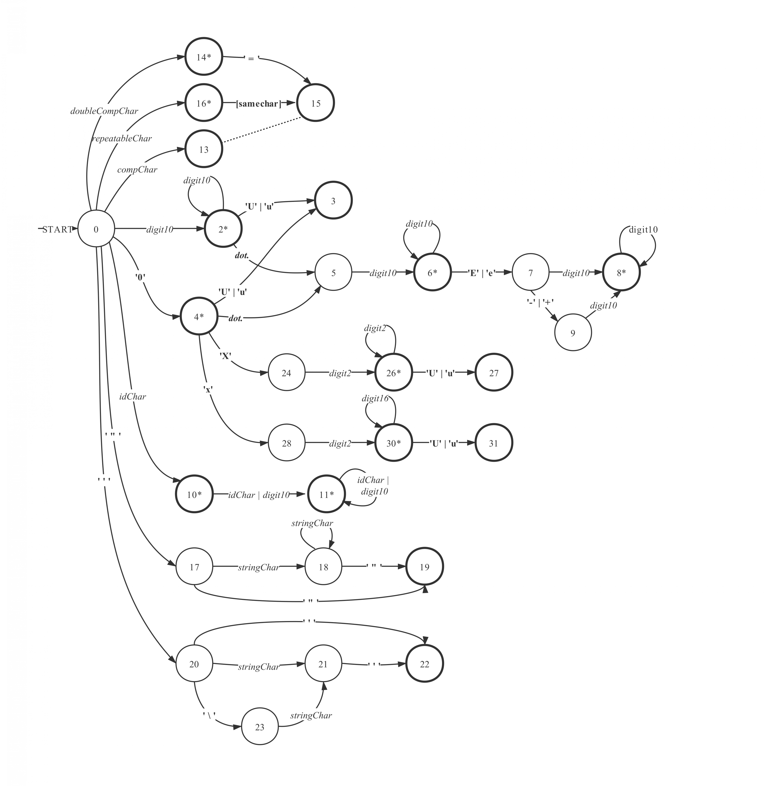

# Satoru词法分析器

## 状态转移

### 状态转移图

  

注: 加粗的环表示接受状态。接受状态中有星号者表示`向前看1个符号，如匹配则转移，如失配则接受并重启词法分析`，无星号者表示`立即接受`。

### 非终结符号定义

in `/Include/lexical_base.hpp`  

`doubleCompChar`->`inline bool isOpreatorCharOnlyDblWEqual(char _c)`  
`[samechar]`->与之前输入的符号相同的符号**或`=`**  
`repeatableChar`->`inline bool isReptbOperatorChar(char _c)`  
`compChar`->`inline bool isSingleOperatorChar(char _c)`  
`digit10`->`inline bool isDigit(char _c)`  
`digit2`->`inline bool isNum2Digit(char _c)`  
`digit16`->`inline bool isNum16Digit(char _c)`  
`idChar`->`inline bool isIdChar(char _c)`  
`stringChar`->所有大于零的字符常量  